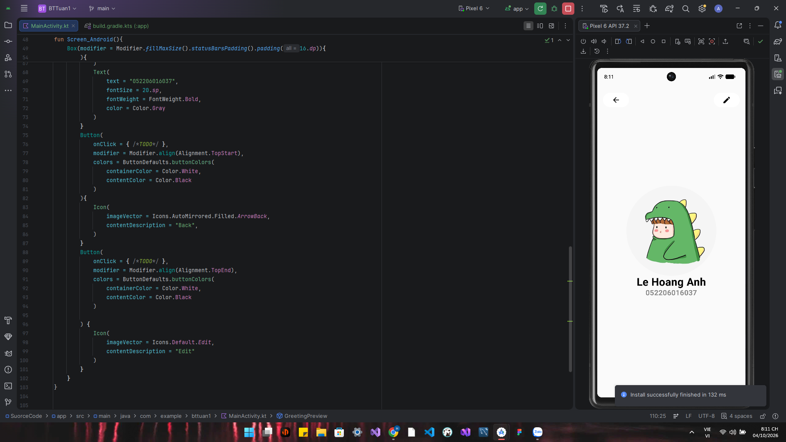

# BTTUAN1 - Lập trình di động
---
## 1.Mong muốn và định hướng của Bạn trong là gì sau kho học xong môn học là gì?
Sau khi học xong môn này có thể tự tin tạo ra sản phẩm được sử dụng trên thiết bị di động có khả năng mang lại doanh thu
và có thể tự tin tìm được một công viêc trong doanh nghiệp.
## 2.Theo bạn, trong tương lai gần (10 năm) lập trình di dộng có phát triển không?Giải thích Tại sao?
Trong tương lai gần thì lập trình di động vấn sẽ phát triển vì hiện nay các thiết bị vẫn đang phát triển và thiết bị di động gắn liền
với cuộc sống con người mọi lúc mọi nơi.
## 3.Viết một ứng dụng có UI:

  

---
TÌM HIỂU MÔ HÌNH GIÁO DỤC CỦA HAA(HOROWITZ ANDREESSEN ACADEMY) VÀ CÁC XU THẾ LẬP TRÌNH HIỆN NAY
## 1.Tìm hiểu mô hình giáo dục của HAA là gì, ưu điểm và nhực điểm của mô hình này.
HAA là mô hình giáo dục hướng đến “learning by doing”, trong đó người học phát triển năng lực thông qua dự án cá nhân, các khóa học 
thực tiễn và trải nghiệm làm việc tại doanh nghiệp. Mô hình có ưu điểm là tăng tính thực hành, khả năng tự học, tiếp cận AI và kết nối với 
doanh nghiệp. Tuy nhiên, HAA cũng có hạn chế như không cấp bằng đại học, yêu cầu tính tự giác cao, chưa phù hợp với tất cả người học và chưa 
có đủ dữ liệu để đánh giá hiệu quả lâu dài.
## 2.Internet và AI đã làm thay đổi cách con người tiếp cận tri thức như thế nào?
Internet và AI đã chuyển cách học của con người từ mô hình chủ yếu ghi nhớ kiến thức sang mô hình tìm kiếm, chọn lọc và vận dụng kiến thức. 
Trước Internet, người học phụ thuộc nhiều vào sách và giáo viên; khi Internet phổ biến, khả năng tìm kiếm thông tin trở thành kỹ năng quan trọng; 
còn trong thời đại AI tạo sinh, người học cần biết đặt câu hỏi, đánh giá câu trả lời và kết hợp AI với kiến thức của bản thân. Vì vậy, giá trị của
người học hiện nay không nằm ở việc nhớ thật nhiều thông tin mà ở khả năng hiểu, kiểm chứng và sử dụng tri thức để giải quyết vấn đề.
## 3.Chúng ta cần làm gì khi AI có thể làm gần như mọi thứ
Khi AI có thể thực hiện ngày càng nhiều công việc, con người cần chuyển từ việc cạnh tranh với AI sang học cách hợp tác và điều khiển AI. 
Kiến thức nền tảng, tư duy phản biện, khả năng sáng tạo, giải quyết vấn đề và kỹ năng giao tiếp sẽ ngày càng quan trọng. Người có lợi thế trong 
tương lai không nhất thiết là người làm mọi thứ tốt hơn AI, mà là người biết sử dụng AI để tạo ra kết quả tốt hơn, đồng thời vẫn có khả năng kiểm 
chứng và chịu trách nhiệm về quyết định của mình.
## 4.Những năng lực nào chúng ta vẫn cần phát triển trng thời đại AI? Và vì sao những năng lực đó quan trọng
Những năng lực quan trọng trong thời đại AI gồm tư duy phản biện, giải quyết vấn đề, sáng tạo, giao tiếp, tự học, kiến thức nền tảng và trách nhiệm
đạo đức. Các năng lực này quan trọng vì AI chủ yếu đóng vai trò hỗ trợ, còn con người vẫn phải xác định mục tiêu, đánh giá kết quả và chịu trách
nhiệm về quyết định cuối cùng. Vì vậy, người biết kết hợp năng lực cá nhân với AI sẽ có khả năng thích nghi và tạo ra giá trị tốt hơn.
